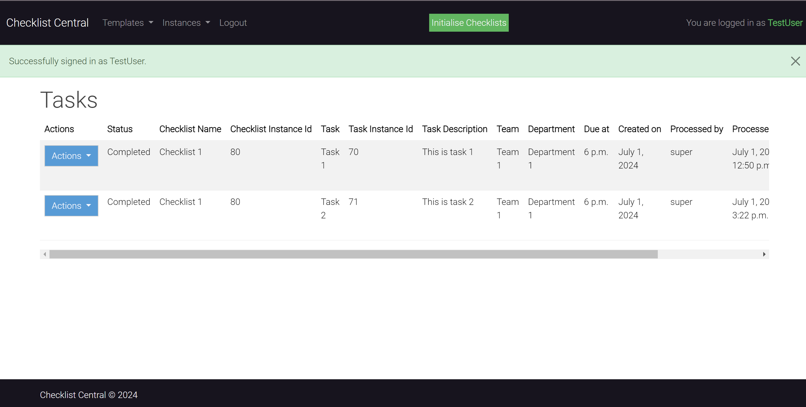
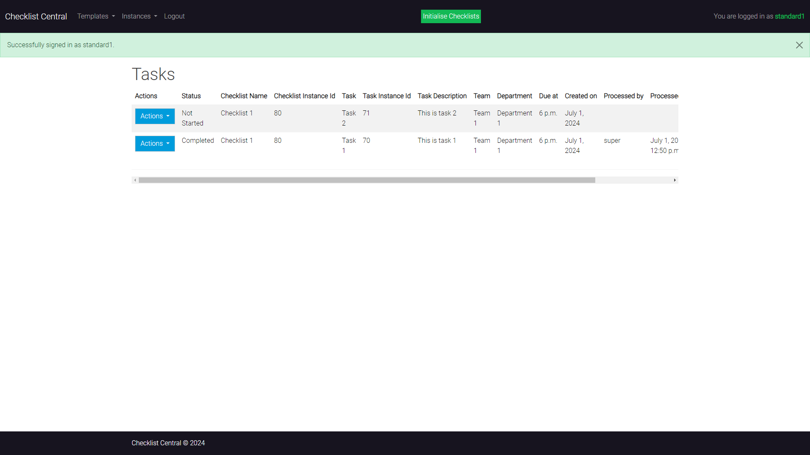
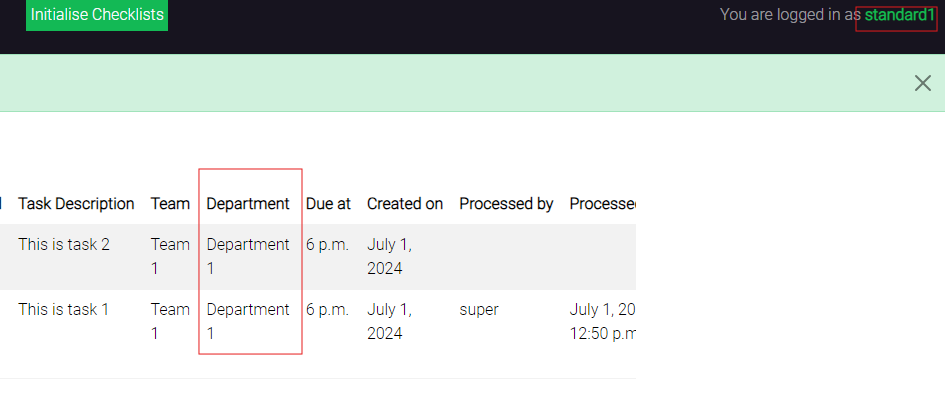
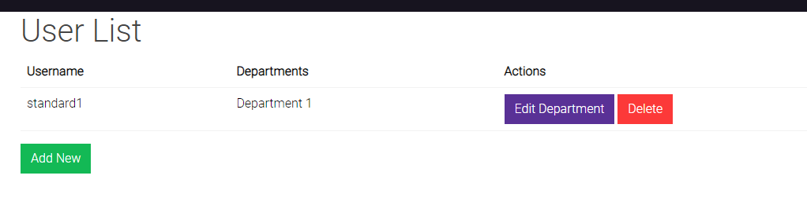
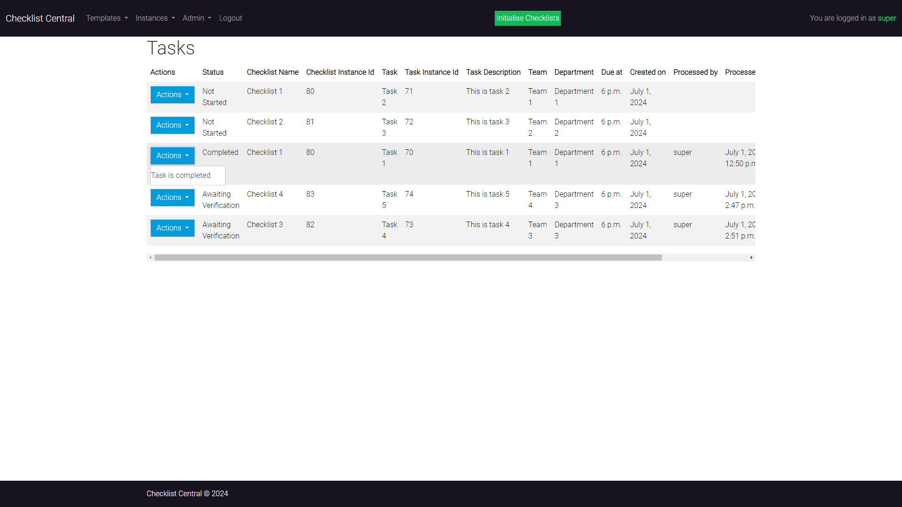
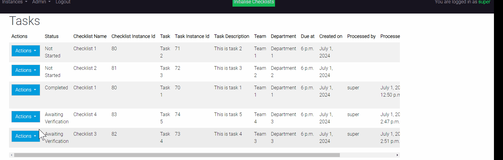
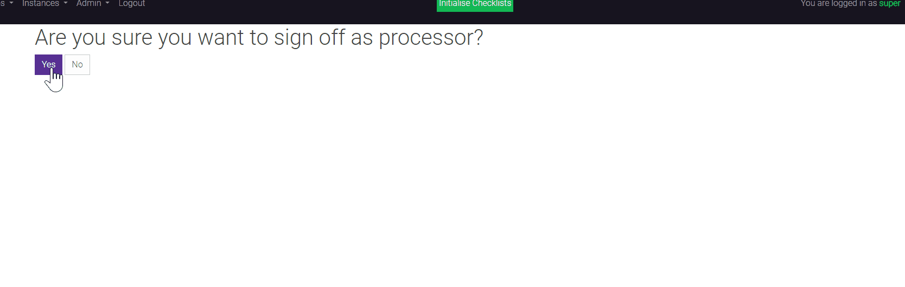
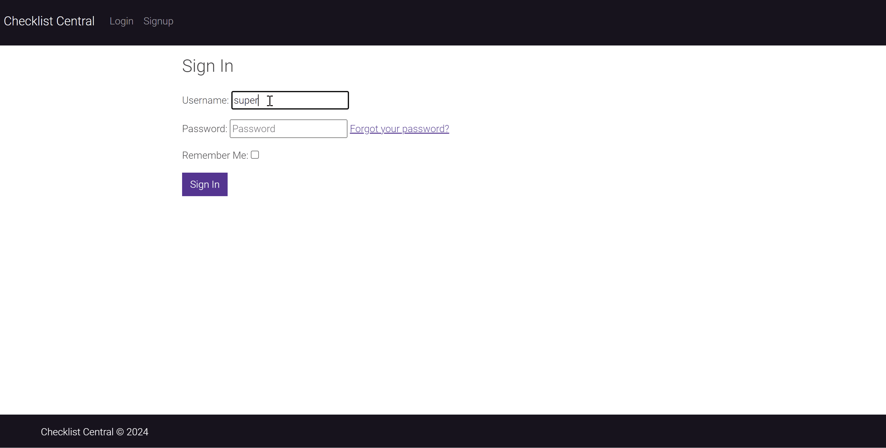
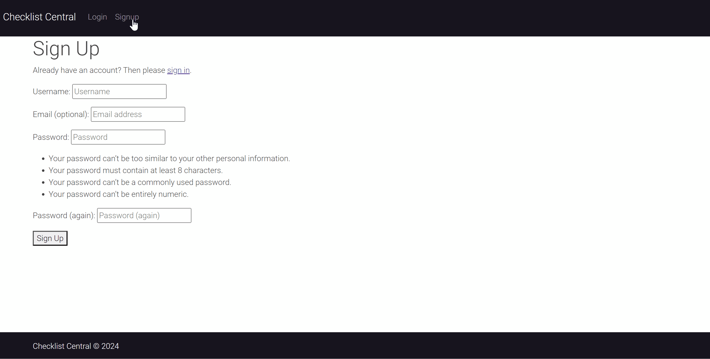

# Checklist Central

- [Checklist Central](#checklist-central)
  - [Overview](#overview)
  - [Agile Methodology](#agile-methodology)
  - [User Experience (UX)](#user-experience-ux)
    - [Strategy](#strategy)
      - [Hierarchical Structure of an organisation](#hierarchical-structure-of-an-organisation)
      - [Wireframes](#wireframes)
    - [Surface](#surface)
  - [Database Desgin](#database-desgin)
    - [UML Diagram](#uml-diagram)
  - [Tools / Technology Used](#tools--technology-used)
    - [Wireframing](#wireframing)
    - [Diagramming](#diagramming)
    - [Development](#development)
    - [Version Control](#version-control)
    - [Backend Framework](#backend-framework)
    - [Deployment](#deployment)
  - [Python Packages](#python-packages)
    - [Miscellaneous](#miscellaneous)
  - [Features](#features)
  - [Future Features](#future-features)
  - [Manual Testing](#manual-testing)
    - [HTML Validation](#html-validation)
    - [CSS Validation](#css-validation)
    - [Python PEP8 Validation](#python-pep8-validation)
    - [Feature / functionality testing](#feature--functionality-testing)
  - [Deployment](#deployment-1)
    - [Pre-requisits for deployment](#pre-requisits-for-deployment)
  - [References](#references)

## Overview

Within many businesses there is a requirement to have repeatable checks throughout the day to ensure the business runs smoothly and important tasks are completed effectively and within a timely mannar. The real world problem is that some of these checklist are housed in different media types. These can be excel spreadsheets, word documents or even printed out pieces of paper. This scenario poses a few problems; it can be time consuming to create these checklists each time they are needed, they can consume physical resources like paper and printer ink, they can be difficult to store and retrive information for audit purposes in an efficient way if they are stored on paper (and even if they are stored digitally as spreadsheets, as they could become lost, deleted, misused, overriden etc). Also some of these checks can have associated procedures related to them that may be housed in a separate place and may require a user to locate the relevant procedures to effectively complete the task. 

Checklist Manager is a solution to this problem, it enables businesses to define digital checklists within a secure application. Providing features such as, Checklist and Task template definition, initialisation of a checklist template as an instance and the associated task templates as an instance at the click of a button, dual authorisation checks, custom profile for access to high level departments by restricting access to other departments, easy to use interface to add all the required information required on a checklist/task. 

## Agile Methodology

This project was planned using agile methodology. User stories were created and added to a board using the Github projects tool. The project can be found [here](https://github.com/users/davep33l/projects/33).

The project was split into 3 main sprints.

- Sprint 1 covered the main chunk of the database and CRUD functionality
- Sprint 2 covered user creation and modification
- Sprint 3 covered the additional functionality required to allow for dual authorisation checks, consistent styling and status views for tasks
- Sprint 4 was an additional sprint added after moving some functionality out of sprint 2, this enhanced further the user aspect of the application
  

## User Experience (UX)
### Strategy

**Business Goals**: To digitalise the manual nature of checklists and tasks to be generated digitally on a schedule within a business setting. 

**User/Business Value**: Provides value to the users by having repeatable tasks stored digitally for re-use in a constistent and secure way. Allowing for easy retrival, user creation or new checklists and tasks, all with a clean UI and user experience.

**Research**: From personal experience (and experience of 100's of colleagues I have worked with and asked opinions of) in working within a publicly listed company for 20 years, the need for reproducable and auditable checklists and tasks that have been completed is high on the list of priorities in running an efficient operations team. Lots of time and effort is spent working with auditors, team members, management and the like, in ensuring procedures and tasks required to complete those proceudres are are documented in a robust and maintainable way. 

#### Hierarchical Structure of an organisation

Below is the structure in which many organisations will manage their teams and workflows, with the below showing the placement of the checklists and tasks within separate teams and departments within the organisation. Building an application that fits this model will likely suit many different organisations. 

#### Wireframes

Below are the wireframes created as part of the design process. The application is kept sleek and minimal as the main priorty of the application is task control and not to disract the user. 

### Surface

A bootstrap theme called Pulse was used, which was obtained from [here](https://bootswatch.com/pulse/). So that the development would be quick and easy, as well as maintain a consistent style across the application. 

## Database Desgin

### UML Diagram

Here is the design of the database. Showing the connection between the department and the teams and the underlying templates. With reference to the templates from the instances of the checklists and tasks. Also a profile which links back to the user model in order to append additional information.

## Tools / Technology Used

### Wireframing

| Tool                                                 | Type             | Purpose                                       |
| ---------------------------------------------------- | ---------------- | --------------------------------------------- |
| [Balsamiq](https://balsamiq.com/wireframes/desktop/) | Desktop Software | Used for creating wireframes for the project. |

### Diagramming

| Tool                                 | Type            | Purpose                                                                      |
| ------------------------------------ | --------------- | ---------------------------------------------------------------------------- |
| [draw.io](https://app.diagrams.net/) | Online Software | Used to create flow charts, diagrams, and scenario diagrams for the project. |

### Development

| Tool                                                                                 | Type             | Purpose                                                                                                                                                                                                                                  |
| ------------------------------------------------------------------------------------ | ---------------- | ---------------------------------------------------------------------------------------------------------------------------------------------------------------------------------------------------------------------------------------- |
| [VS Code](https://code.visualstudio.com/)                                            | Desktop Software | The application used to develop the website. Various extensions such as Markdown Preview Github Styling, Git Graph were utilized to assist with the development process.                                                                 |
| [python](https://www.python.org/)                                                    | Desktop Software | Requirement for development.                                                                                                                                                                                                             |
| [Windows Subsystem for Linux](https://learn.microsoft.com/en-us/windows/wsl/install) | Desktop Software | To enable the development environment match as closely as possible the deployment environment as both are Linux based. Changed mid-project from Windows to WSL in order to natively trial some python libraries and OS-specific commands |
| [Heroku CLI](https://devcenter.heroku.com/articles/heroku-cli)                       | Desktop Software | Used to provide a local deployment for easier testing (using `heroku local` command).                                                                                                                                                    |
| PG4 Admin                      | Desktop Software | Used to access the database and see the tables created for validation during development                                              |

### Version Control

| Tool                          | Type             | Purpose                                                                                                              |
| ----------------------------- | ---------------- | -------------------------------------------------------------------------------------------------------------------- |
| [Git](https://git-scm.com/)   | Desktop Software | Used as version control from the terminal inside VS Code and was pushed to a remote repository hosted by github.com. |
| [Github](https://github.com/) | Online Software  | Used to store the code used for the website and to host the website using GitHub Pages.   

### Backend Framework

| Tool                                              | Type              | Purpose                                                                                                    |
| ------------------------------------------------- | ----------------- | ---------------------------------------------------------------------------------------------------------- |
| [Django (4.2.13)](https://www.djangoproject.com/) | Backend Framework | Django is a high-level Python web framework that encourages rapid development and clean, pragmatic design. |

### Deployment

| Tool                                                           | Type            | Purpose                     |
| -------------------------------------------------------------- | --------------- | --------------------------- |
| [Heroku](https://www.salesforce.com/products/heroku/overview/) | Online Software | Used to deploy the project. |

## Python Packages

| Tool                                                                               | Type                   | Purpose                                                                                                                                                                           |
| ---------------------------------------------------------------------------------- | ---------------------- | --------------------------------------------------------------------------------------------------------------------------------------------------------------------------------- |
| [venv](https://docs.python.org/3/library/venv.html)                                | Python Package/Library | Used to create a virtual environment for package management.                                                                                                                      |
| [Gunicorn (20.1)](https://gunicorn.org/)          | Backend Webserver | Gunicorn 'Green Unicorn' is a Python WSGI HTTP Server for UNIX.                                            |
| [dj_database_url (2.1.0)](https://pypi.org/project/dj-database-url/)          | Python Package/Library | This simple Django utility allows you to use a database url as an environment variable within a django application  |

### Miscellaneous

| Tool                                                           | Type            | Purpose                                                        |
| -------------------------------------------------------------- | --------------- | -------------------------------------------------------------- |
| [Am I Responsive?](https://ui.dev/amiresponsive)               | Online Software | Used to create the responsive image for the top of the readme. |
| [CI Python pep8 Linter](https://pep8ci.herokuapp.com/)         | Online Software | Used to lint my python code according to pep8 guidelines.      |
| [HTML Validator](https://validator.w3.org/)                    | Online Software | Used to validate my html pages                                 |
| [CSS Validator (Jigsaw)](https://jigsaw.w3.org/css-validator/) | Online Software | Used to validate my html pages                                 |

## Features

- Ability to structure task generation based on department, team and checklist they are part of
- Ability to have control over two different users first authorisng a task and a different user second authorising a task
- Ability to add the department to a standard users profile so they do not see everything in the database (with both view level and template level control)
- User sign on, sign out and register functionality
- Ability to generate a predefined checklist and task template into its own instance
- Only logged on users can access any functionality, and are redirected to the sign on screen if not authenticated

## Future Features

- Utilise a clock to schedule the checklists to generate at a specified time each day. Using something like celery or APScheduler (with heroku). Limited time to complete this feature
- Ability to add more than one department to a user
- Enhanced filtering and searching by task IDs
- Improved Auditing trail for the tasks
- Ability to add commentary to the tasks when signing off
- Ability to upload evidence to the task (like screenshots or documents)

## Manual Testing

### HTML Validation

| Test # | Page | Outcome | Evidence |
|--------|------|---------|----------|
|     1   |   checklist_instance_confirm_delete.html   |  pass       |          |
|     2   |   checklist_template_confirm_delete.html   |   pass      |          |
|     3   |   department_confirm_delete.html   |   pass      |          |
|     4   |   task_template_confirm_delete.html   |   pass      |          |
|     5   |   team_confirm_delete.html   |   pass      |          |
|     6   |   user_confirm_delete.html   |   pass      |          |
|     7   |   checklist_instance_list.html   |   pass      |          |
|     8   |   checklist_template_list.html   |   pass      |          |
|     9   |   department_list.html   |   pass      |          |
|     10   |   task_instance_list.html   |   pass      |          |
|     11  |   task_template_list.html   |   pass      |          |
|     12   |   team_list.html   |   pass      |          |
|     13   |   user_list.html   |   pass      |          |
|     14   |   checklist_template_edit.html   |   pass      |          |
|     15   |   department_edit.html   |   pass      |          |
|     16   |   task_instance_edit.html   |   pass      |          |
|     17   |   task_template_edit.html   |   pass      |          |
|     18   |   team_edit.html   |   pass      |          |
|     19   |   user_edit.html   |   pass      |          |
|     20   |   index.html   |   pass      |          |
|     21   |   initialise_checklists.html   |   pass      |          |

### CSS Validation

| Test # | Page | Outcome | Evidence |
|--------|------|---------|----------|
|     1   |   style.css   |  pass       |         |

### Python PEP8 Validation

| Test # | Page | Outcome | Evidence |
|--------|------|---------|----------|
|     1   |   admin.py   |  pass       |        |
|     2   |   apps.py   |  pass       |       |
|     3   |   forms.py   |  pass       |       |
|     4   |   models.py   |  pass       |       |
|     5   |   urls.py   |  pass       |       |
|     6  |   views.py   |  pass       |       |

### Feature / functionality testing

| Test # | Feature/functionality | Outcome | Evidence |
|--------|------|---------|----------|
|     1   |   That an admin user can see the admin dropdown   |  pass       |        |
|     2   |   That an standard user cannot see the admin dropdown   |  pass       |       |
|     3   |   That there is a notifcation for a user being logged in   |  pass       |       |
|     4   |   That a standard user can only see the departments they are assigned to   |  pass       |       |
|     5   |   That an admin user can see all the tasks and see all the navigation and the status of the task  |  pass       |       |
|     6   |   That you cannot complete a task that is already complete   |  pass       |       |
|     7   |   That the same user cannot verify a task   |  pass       |       |
|     8   |   That two different users can process and verify a task   |  pass       |       |
|     9   |   Full features of adding a department, adding a team, adding a checklist template, adding a task template and initialising a template   |  pass       |         |
|     10   |   Admin user can add a department to a user once they have an account on the system. No tasks are shown for that user until they have been assigned a department  |  pass       |       |

## Deployment

The code for this project is housed on Github, the database is managed by the CodeInstitute and the projected was deployed to Heroku.

The project can be cloned or forked from the [this](https://github.com/davep33l/checklist-central.git) link.

### Pre-requisits for deployment

- Create a new app within Heroku
- Clone/Fork the repo from Github
- Install the requirements.txt file
- Create a Postgres Database
- Obtain the Database URL
- Create a local env.py file if you want to test locally with:
  - A DATABASE_URL
  - A SECRET_KEY
- Run makemigrations, migrate and createsuperuser functions 
- Link the repo code to the app in heroku
- Set up the following environment variables in heroku
  - A DATABASE_URL (more details below)
  - A SECRET_KEY

## References

The django documentation and the LMS provided me with the tools and information I needed to complete this project. 
